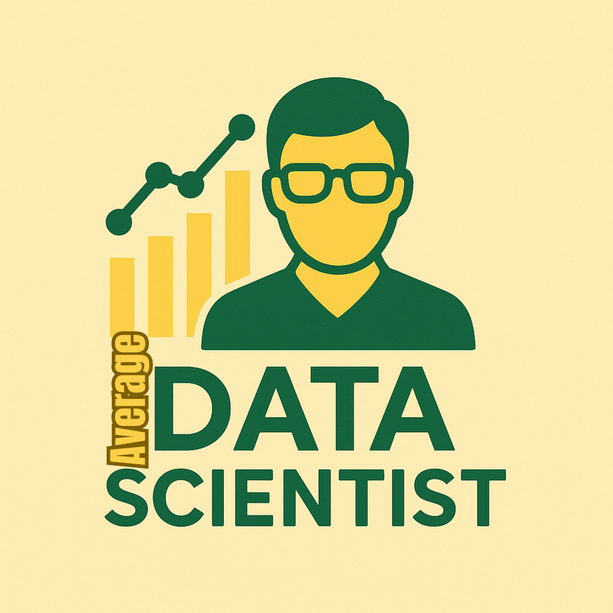

# TADSTech - The Average Data Scientist



Professional data science services and portfolio website built with Flutter. One codebase for all platforms - web, mobile, and desktop.

## Features

- 🚀 Cross-platform Flutter application (Web, iOS, Android, Desktop)
- 🎨 Modern UI with responsive design
- 📊 Showcase of data science projects and services
- 🔗 GitHub integration to display open-source projects
- 📱 Optimized for all screen sizes

## Live Demo

Check out the live deployment: [https://tadstech.web.app](https://tadstech.web.app)

## Technologies

- **Frontend**: Flutter (Dart)
- **Styling**: Custom theme with Google Fonts
- **Routing**: go_router

## Getting Started

### Prerequisites

- Flutter SDK (version 3.7.0 or higher)
- Dart SDK (version 2.19.0 or higher)
- IDE (VS Code or Android Studio recommended)

### Installation

1. Clone the repository:
   ```bash
   git clone https://github.com/tadstech/tadstech.git
   cd website
Install dependencies:

bash
flutter pub get
Run the app:

bash
flutter run -d chrome # For web
flutter run # For mobile
Project Structure
lib/
├── core/          # Core functionality
│   ├── constants/ # App constants
│   ├── theme/     # App theming
│   ├── utils/     # Utility functions
│   └── widgets/   # Reusable widgets
├── features/      # Feature modules
│   ├── about/     # About page
│   ├── contact/   # Contact page
│   ├── github/    # GitHub integration
│   ├── home/      # Home page
│   ├── services/  # Services pages
│   └── shared/    # Shared components
└── main.dart      # App entry point
Building for Production
bash
# Build for web
flutter build web --release

License
This project is licensed under the MIT License - see the LICENSE file for details.

Contact
For professional inquiries, please visit tadstech.com/contact

For development questions, open an issue on GitHub